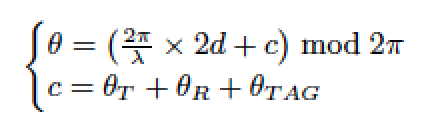
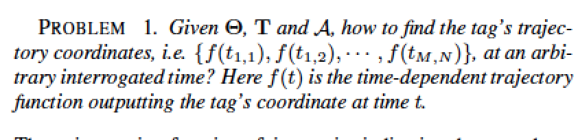
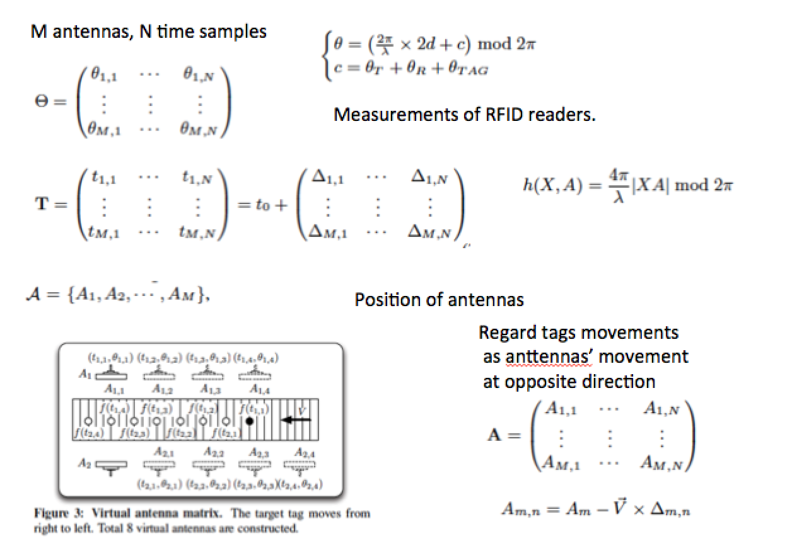
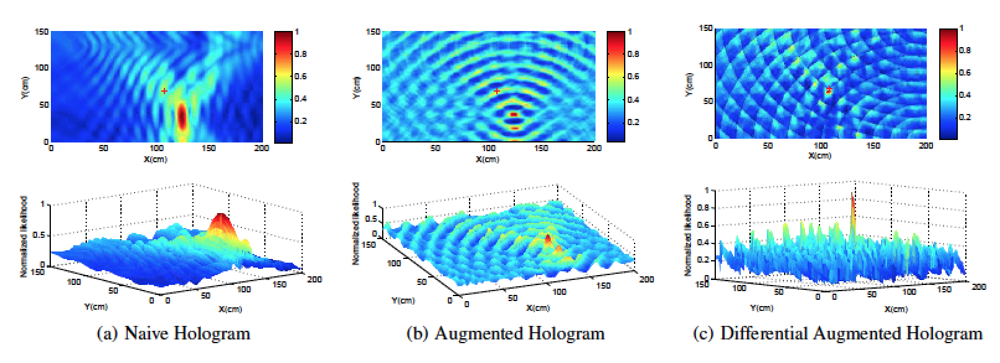
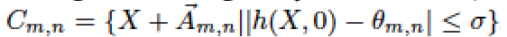
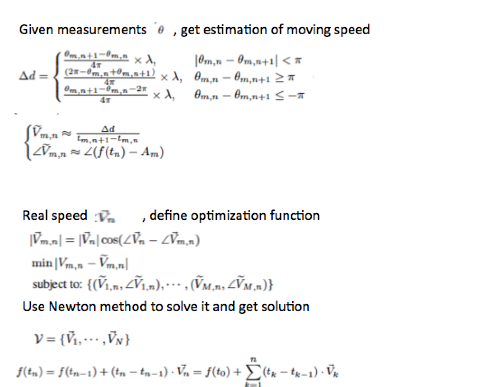

##Review: Tagoram: Real-Time Tracking of Mobile RFID Tags to High Precision Using COTS Devices

From Liu Yunhao, etc. (Tsinghua Univ.) MobiCom 2014 best paper cited by 58

Summary
***
综合评价：这篇文章拿到了MobiCom’14的best paper，归功于它完备的实验方法和测量结果。它使用相位估计的方法进行RFID tag的追踪，利用tag的移动性构造虚拟天线阵列从而获得运动物体的初始位置。最初需要对测量环境划分格点，并以各个格点反射天线信号的来回相移为基础计算到各个RP的距离。发送、接收端和tag反射端都带来了噪声，这个噪声主要由热噪声和device多样性造成。本文对这两种噪声进行建模，在最后的位置估计方法中尽可能多的消除两种噪声的影响。使用Hash方法减少了计算量，实现了实时追踪的实际效果。本文做了多组测量试验，非常细致地比较了多个方法，证明了本文方法的鲁棒性，是一篇很有参考研究价值的RFID定位论文。

#### Content
***

#####背景
现存RFID定位技术的弊端：1.无法高精度定位移动RFID tag；依赖于参考点的部署；受多径影响

影响精度的因素：COTS RFID的相位误差0.0015 radians,可能达到mm级精度，但受接收端热噪声、设备diversity的相移；LOS和NLOS的混合

#####实验：
RFID定位系统Tagoram
室内实验：直线与圆形轨迹追踪精度中位数分别为5mm和7.29mm， 与RSS、OTrak、PinIt、BackPos相比达到82X, 21X, 16X；随机轨迹精度12.3cm
产品级实验：使用定制设备，多天线RFID reader(TrackPoint) 北京首都机场、三亚凤凰国际机场的自动行李排序；精度6.35cm；2013-2014公用110000RFID标签、12亿追踪数据，实现6.35cm的精度

实验平台：
ImpinJ reader and Alien EPC Gen- 2 UHF RFIDs

工作频率：920 ∼ 926 MHz band with frequency hopping
reader extend LLRP protocol to report phase value

实验内容：
Controlled case下的定位精度：
1）对比其他定位方法：RSS，Otrack，PinIt，BackPos，DAH
2）对比几种热力图：Naive，AH，DAH
3）测量实时性
4）探究参数对精度的影响：频率（主频），方向，距离改变
unControlled case下的定位精度：
1) speed chain估计

机场实验中的TrackPoint追踪精度、效率、鲁棒性（多径）
#####实验原理

本文的基础是利用passive RFID tag接收reader发出的RF信号并调制反射回去的特性来进行tag定位。由于LOS，无线信号的传播距离为tag到reader距离d的2倍，对应发生的相移\theta为2*pi*d/\lambda。利用COTS RFID reader的定位精度（典型CTOS RFID reader如ImpinJ R420精度可达到0.038mm，范围10m），可以精确读出传播时间内发送的相移，从而可以进而估计距离d。

首先建模：从transmit到receive 发生的相移由来回传播距离以及噪声组成。噪声包括发送接收时的热噪声和tag反射特性组成

经验实验测的热噪声为标准差为0.1的高斯白噪声；同一位置由于Tag variation测量值范围0.3～5.8 radians，因此不可忽略且无法预料

定位问题：

文章把该问题分解为两种情况：轨迹固定和轨迹随机。

###### Case1：Movement with Know Track:假设tag运动速度是匀速V(t)
---

一些notation：
X是grid坐标，A是天线坐标

tag按估计的匀速运动，可看成tag固定不动，A往反方向的匀速运动。于是可得到采样矩阵A——利用tag的移动构造虚拟天线阵列

######利用RF Hologram 热力图估计trace起始位置
三种：NH, AH, DAH
三种热力图效果对比：

NH: 问题在于ambiguous太大，peak跨好多个grid
AH: 考虑热噪声的影响，引入高斯模型
DAH: 消去tag diversity的误差

热力图的计算计算量太大，且随热力图的规模快速增长。方法：利用hash表，因为CTOS reader的phase为12bit编码，因此构造2^12个entry的hash表，且变换参考系避免计算XA距离（减少60%计算量）：

###### Case2: MOVEMENT WITH UNKNOWNTRACK：速度不定，轨迹不定，之前方法的矩阵A无法得到。
---

然而上式中f(t0)未知，因此对每一个格点X都作为起始点估计一条trace，取PSNR幅度最大的为最可能的trace
