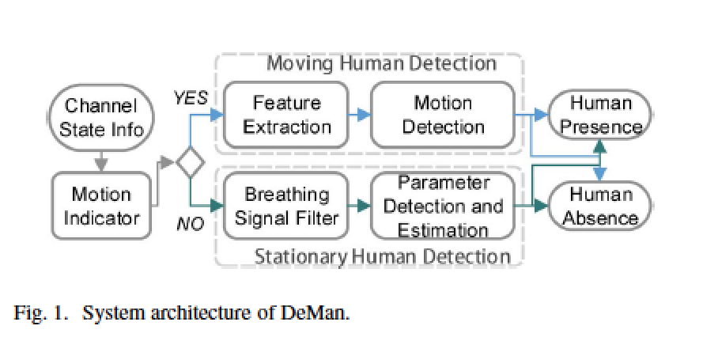

## WiFi Based Localization/ Indoor Human Activity Recognition

### 文章列表
- Electronic Frog Eye: Counting Crowd Using Wifi 
- 802.11 with Multiple Antennas for Dummies (Daniel Halperin. Univ. of Washington & Intel Labes)
- DeMan: Non-Invasive Detection of Moving and Stationary Human with Wifi (Liu Yunhao)
- Human Mobility Enhances Global Positioning Accuracy for Mobile Phone Localization (Liu Yunhao)
- E-eyes: Device-free Location-oriented Activity Identification Using Fine-grained WiFi Signal(Stevens Institude of Technology, USA)
- Wisee: Whole-Home Gesture Recognition Using Wireless Signals(Qifan Pu, Univ. of Washington)

### Electronic Frog Eye

### Deman(Liu Yunhao etc)
综述
讨论了如何区分Moving和Stationary Person以及无人的室内情况。先用每个载波的复数CSI相关矩阵特征值，发现Moving和Stationary/无人的阈值，而后对人的呼吸特征建立了正弦模型，各载波作参数估计，用LMS的方法求出同一的呼吸频率，与人类呼吸频率比较区分是否有人
- 提出一个同时检测移动和静止人的框架；基于Wifi、环境独立、非侵入式
- 设计实现了一个利用人体呼吸胸腔震动来检测静止人的方法
- 利用了CSI的相频信息

方法
CSI复数表示
$$
H_k = ||H_k||e^{j\Phi(H_k)}
$$

- CSI 经过Hampel Identifier提取outlier观测
- 通过motion indicator粗度检测是否移动，若移动则提取特征（每个载波的复数CSI计算相关矩阵，提取最大特征值，组合成两维特征向量）

### Human Mobility Enhances(Liu Yunhao etc)
综述
介绍了利用惯性传感器对GPS定位的纠正。精度可达到5~8m（无纠正15m以上）；主要工作：将GPS坐标系与Local Sensing坐标系结合，用learning的方式建模
关键概念： dead reckoning
方法：
最优化的transform使得误差最小
- translation
- scaling
- rotation

### E-eye
综述
文章利用CSI信息识别原地和移动的动作，使用半监督学习获得行为profile作为识别的对照。
主要focus在location-oriented 活动识别（即，人类活动与场所的联系，比如厕所刷牙，厨房做饭）
- 用较少的发送设备从CSI信息中提特征，识别房屋中的in-place活动
- 利用一个wifi ap和几个设备的框架，采用相关Profile matching 算法匹配已知活动
- 动态构建profile，若无线设备移动了/替换了可以动态自适应
- 实验：2套公寓四个月数据、1个AP3个连接设备，精确区分8个跨房间的走路活动(20轮)，9个日常活动（59轮）和其他活动(100轮)，精确度96%，1个device则92%
- 宽信道可以增加准确率

限制：只能识别单人，无宠物和其他移动物体

方法
1. 区分walking和in-place activity: 前者幅度variance 大，后者幅度variance小但是有repeat Pattern；基于variance阈值区分两种活动
2. walking movement： Multiple-Dimensional Dynamic Time Warping(MD-DTW)，归一化不同速度的行为；in-place activity: 比较CSI分布直方图，用Earth Mover Distance(EMD，两个分布相似性的度量)作为距离度量
3. 生成profile：聚类-用户标记

粗粒度AI：每个载波CSI C(P)都对应一个方差V(P),累计移动方差为所有载波上V(p)之和，最大累计移动方差与阈值20比较区分移动or原地

原地活动的检测：EMD比较CSI幅度分布，CSI profile中已知活动最近的距离若小于一个阈值则归类，反则为unknown活动；另不同场景同一个动作分别建立csi profile

walking 活动检测：移动的CSI特征与trace非常相关；MD-DTW检测
Doorway检测：对于很多unknown活动，根据跨越哪到门判断接下来可能的活动(treated as in-place,单独建立profile)
实现：
多设备的连接网络，多个距离度量的线性加权，

### WiSee
综述
文章提出利用WiFi多普勒频移的方法来检测人类手势
- 提出了一个能在LOS,NLOS, TTW环境下使用的无线系统Wisee
- 展示了一个从无线信号种提取手势信息的算法：从宽带OFDM传输中提取多普勒频移，并对９种手势进行分类识别

方法
1. 从无线信号中提取多普勒频移
$$
\Delta f \propto \frac{2vcos(\theta)}{c} f
$$
难度在于在无线环境下人类运动导致的多普勒频移非常小；以WIFI为例，5GHZ对应17HZ(挥手0.5m/s)，被频谱覆盖
解决方案：接收端转化接收信号为窄带脉冲
特征：接收端对M个重复的OFDM symbol作MN点FFT时，每个信道的带宽减少了M倍，故而每个子信道都有窄带脉冲
方法：在接收端把所有的arbitrary　symbol转化为与第一个一样的symbol,获得窄带脉冲而不影响信号的多普勒信息。
疑难：频移、发送端需连续发送符号、循环前缀
2. 映射多普勒频移到手势
半秒FFT得到分辨率为２HZ的频谱，使用带通滤波器获得８～１３４HZ的频段信息
信号分段：手势特征由正负多普勒频移构成，　根据信噪比阈值，手势开始时信噪比变大，结束时信噪比变小，根据SNR和阈值关系判断信号起止位置。
手势分类：映射每个类为３位'1''-1''2'的数字组合，表示多普勒频移的方向
3. 多人干扰：目标用户执行特定动作，接收端与preamble匹配,同时根据接收到的preamble信息找到权值W对应的MIMO channel使得多普勒能量最大
$$
D_m = \sum_{i=1}^N W_n D_{nm}
$$
N为接收端天线数，$$$D_{nm}$$$ 表示第n个天线上第m段的多普勒能量，梯度下降寻找最小值
从而锁定target　user的方向
4. 多径效应
多径和镜面反射等干扰会导致多普勒频移正反颠倒。在分段中Wisee只需捕捉能量最大的路径，所以不需要太多天线来区分多径效应。而多径造成的正负多普勒频移颠倒只需利用preamble来纠正，因为默认对着接收端的正推是preamble信号

实现步骤

