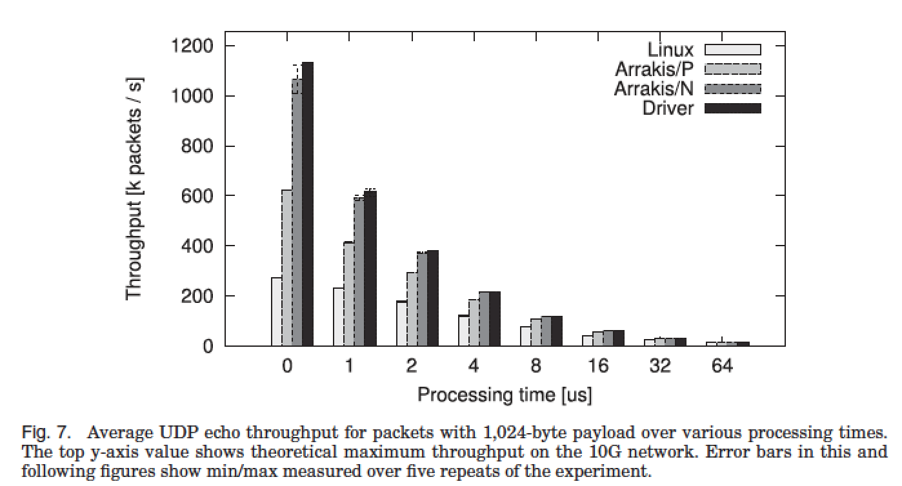

## Review: Arrakis: The Operating System Is the Control Plane
OSDI’14 bast paper from University of Washington

#### 背景
在数据中心里，与网络设备、存储设备的IO操作花费了非常多的时间在linux kernel的各个部分。一个只运行recvmsg和sendmsg两种操作的UDP echo server在kernel里花费的时间如Table I 所示

Network Stack Overhead: 对于纯网络信息传输操作，在Linux里网络栈占据了30%多的overhead，同时buffer的拷贝和usermode和kernel mode的context switch也造成了一部分的overhead。

Storage Stack Overhead: 运行10,000次fsync（强制写回磁盘），造成的overhead可见Fig 2。这部分overhead主要由用户空间和Kernel空间的数据拷贝、参数和访问权限检查、block和inode分配、VFS层、Snapshot管理（btrfs）、元数据更新产生。

Application Overhead: 对于Redis NOSQL Store（log方式写，从in-memory data structure读）的各个磁盘存储操作。Redis的工作流程以Table II左边的各个操作依次执行，各阶段的overhead如表所示。

Arrakis是一个新定义的操作系统，它将Kernel移出了设备IO的数据路径，使得用户应用可以直接访问设备，减少了kernel带来的overhead，同时保留了操作系统的Process Protection, Resource Limit, I/O protection flexibility, Global naming.

#### 设计
SR-IOV是一个为共享物理硬件的多个虚拟机提供高速度设备读写能力的硬件技术。 具有该功能的PCI设备作为"physical function"，可以split出多个virtual function 并一一映射给虚拟机实现复用。
IOMMU：为虚拟机提供的MMU功能避免直接访问物理地址。

##### Hardware Model
hardware-independent layer: 硬件模型，模拟出现有的IO设备的基本feature。VIC应提供queues和rate limiters。queues用于user space send&receive
VNIC（Vitrual Network Interface Card）：还应该有filter——transmit filter & receive filter
VSIC：独立的命令队列；与VSA(Virtual Storage Area)关联

VSIC 仿真：RAID controller分别提供一个固定长度的request/response descriptor循环队列，分别用PR指向队列头RQD(request descriptor)长256B且包含SCSI命令+目标logic disk numer；Response descriptor指向完成的RQD的队列entry。
工作方式：VSIC core  round-robin地轮询 VSIC PRs和物理controller response队列队首；若第i个VSIC的PR post了一个新的RQD， VSIC核则解析出RQD包含的逻辑磁盘号及VSA entry，检验其VSA边界，合乎要求则分配给物理controller，并用一个RQD field编辑RQD和VSIC的对应关系，等物理controller返回则将结果拷贝到对应VSIC的response queue里

##### Control Plane Inteface
抽象：VICs, doorbells（通知事件完成）, filters（自定义转发规则）, VSAs, rate specifiers.

##### Storage Dataplane
数据结构Caladan: persistant dataplane structure操作立刻在磁盘上永久存储，in-memory避免了marshalling；数据结构中包含metadata避免了文件系统inode和数据block不放在一起的寻址overhead。

VSA起始位置包含一个header（版本号，entry 数，存储设备的MTU，指向Calanda结构头尾的指针）

##### 实现
基于Barrelfish操作系统，实现了SR-IOV, 为Intel 82599 实现了physical/virtual function;
用户空间网络栈：Extaris；Caladan；

##### 性能
Table I 和 Table II反应出Arrakis消除了网络调用和Kernel crossing的overhead，大大降低了Network Stack的延迟；fsync的速度大大提升，Storage stack被大大简化。
最好情况下Arrakis/P outperform Linux 2.3X；Arrakis/N outperform Linux 3.9X
四个实验：
1)Server-Side Packet Processing Performance；

2)Memcached Key-Value Store

3)Redis NoSQL Store

up to 9x throughput, 81% speedup
4) HTTP Load Balancer

5) IP-layer middle box

##### 相关工作
SPIN [Bershad et al. 1995] and Exokernel [Ganger et al. 2002]提出减小kernel的共享部分，针对不同的应用定制操作系统功能。

VIA [Compaq Computer Corp. et al. 1997] and Infiniband [Infiniband Trade Organization 2010]：减少或消灭操作系统在收发数据包的参与，主要强调并行应用的throughput最大化。 本文的网络模型更具有一般性，支持peer-to-peer和client-server

Dune [Belay et al. 2012]：nested paging，使得用户层直接操作内存管理

Exitless IPIs [Gordon et al. 2012]：绕过VMM多路复用VM间的硬件中断

Netmap [Rizzo 2012]：在用户空间使用DMA实现高吞吐网络IO，但发送、接收仍需调用syscall以检查操作权限，同时利用批量读写以达到高吞吐量（增加了延时）。

IX [Belay et al. 2014]：实现了自定义的，per-application网络栈；protection domain批量调用syscall；而Arrakis不需要该批量调用syscall的操作——一般的操作都在用户空间完成。

mTCP[Jeong et al. 2014]：scalable user-level TCP，相当于Arrakis的Extaris部分

OpenOnload：hybrid user- and kernel-level网络栈，与Linux application完全二进制兼容（什么意思？），需要在kernel里保留一堆socket状态数据, 只支持一个传统socket API

DFS [Josephson et al. 2010] and PMFS [Dulloor et al. 2014]：Focus在减少传统文件系统和块设备驱动的overhead，都是kernel level文件系统；前者利用flash storage layer来实现之前OS提供的功能，如块分配；后者利用byte addressability of persistent memory来绕过block layer

Moneta-D [Caulfield et al. 2012]：是个提供user-level 快速访问SSD的软硬件平台；硬件和kernel检验操作权限，user-level驱动与设备直接通信。Arrakis不需要检查权限，因为Application可以完全控制自己的VSA

Aerie [Volos et al. 2014]：多进程与受信任的用户文件系统服务通信获得文件元数据和锁操作，然后直接对硬件操作读写文件。
