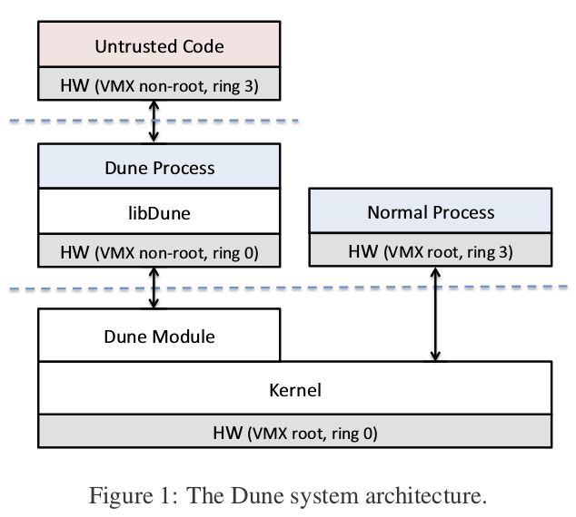
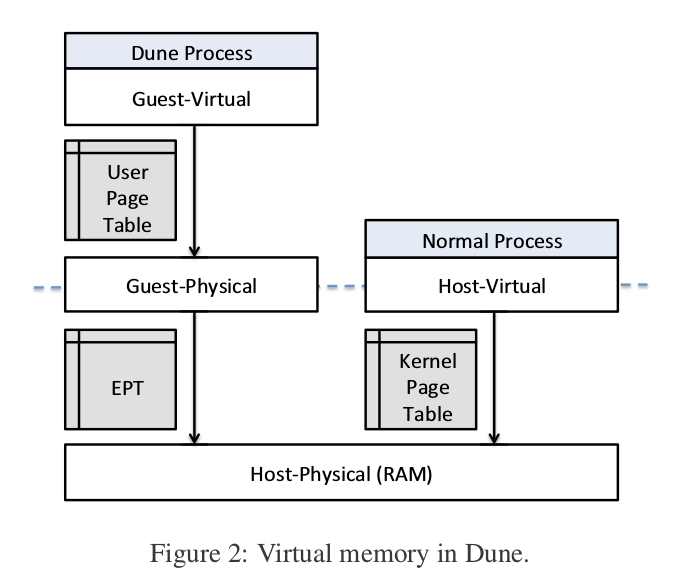
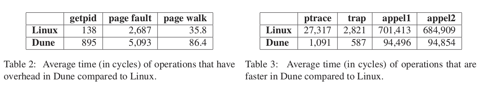

## Paper Review 
##### *Dune: Safe User-Level Access to Privileged CPU Features*

## 综述
Dune是一个为应用提供安全直接的硬件访问（如环保护、页表和快表标记读写）的系统，同时兼容对现存OS的访问。
主要贡献在：
1. 基于硬件虚拟化基础，提出了一个安全高效地为用户应用提供特权硬件功能而同时保留了标准OS抽象的设计
2. 详细测试了Dune架构在Exception,Paging和priviledge modes下的好处和性能提升
3. 展示说明并评测了三种运行在Dune上的应用：sandboxing，priviledge separation和gc

## 硬件和虚拟化
Dune的实现基础：Intel VT-x Extension
* VT-x将CPU分成两种操作模式：VMX root（运行VMM）和VMX-non-root(运行客户OS)
* VMX模式间切换：
	* VMLAUNCH/VMRESUME指令：进入VMX-nonroot
	* HLT/VMCALL：退出回VM-root模式
	* VMCS：保存VMM上下文切换和状态信息

* Extensible Page Table(EPT)第二层虚拟地址转换，介于host和guest os 间

基于VT-x，Dune实现了对以下指令的支持

*  Privilege Modes（Dune利用VT-x non-root下的ring0-ring3权限管理模拟与LinuxＫernel一致的特权模式）
	* SYSRET,	SYSEXIT,	IRET	

* Virtual	Memory(Dune: 用户直接控制页表地址转换和访问权限控制而不需要切入内核态)
	* MOV	CRn,	INVLPG,	INVPCID	

* Exceptions（Linux Overhead: privilege mode 转换、upcall machanism如signal）
	* LIDT,	LTR,	IRET,	STI,	CLI	
* Segmentation
	* LGDT,	LLDT

## 系统架构设计

#### 组件：
* Dune Process: Ｄune的一个实例，类似guest os但在主机上以进程形式存在。主机进程可随时切换至Ｄune进程，但反之不可逆。
* Dune Module: 作为kernel的可安装插件；截取Ｄune process的中断从而调用kernel的syscall
* ＬibDune：封装了Ｄune直接访问硬件资源功能的库，包括页表管理器(PTM)，ELF loader， 页分配器，管理错误和系统调用的API

#### Ｄune与ＶＭＭ对比：
* Ｄune轻量级
* Hypercall: VＭM调用虚拟接口，Ｄune调用syscall
* Ｄune不需要支持所有的物理硬件接口，对于不支持的硬件调用可通过VMCALL调用主机系统的kernel syscall
* Dune 限制与主机系统的差异，从而不需保存大量得到guest os信息
* Ｄune不直接分配物理地址空间，而是通过ＥＰＴ作第二次的虚拟地址映射

#### 内存管理

* 地址转换: host-virtual <-> host-physical、 guest-virtual<->guest-physical、 guest-physical <-> host-physical
* 为了在Dune process中模拟整个地址空间，手动获取进程在主机的地址空间并手动更新ＥＰＴ；为了兼容kernel对硬盘交换、写回操作等的处理，Ｄune hook到了ＭＭＵ通知链（类似ＫＶＭ在文章[30]的方法）

#### 保存OS接口
Dune Process中通过调用VMCALL访问OS system call.
signal的处理：模拟中断

#### 用户模式bootstrapping
Dune Module: 1. 初始化页表 2.调用ioctl 3.初始化%CR3
LibDune: load GDT, IDT， 建立 stack等，提供操作系统环境

## 应用

Ｓandboxing, Wedge, Garbage Collection

## 性能检测
Ｄune的主要Ｏverhead: 1.ＶT-x在kernel间切换增加的开销 2.使用EPT使得TLB miss更昂贵
对几个应用的测试表明，Dune在ptrace等本身调用复杂的命令时有明显的性能提升。

