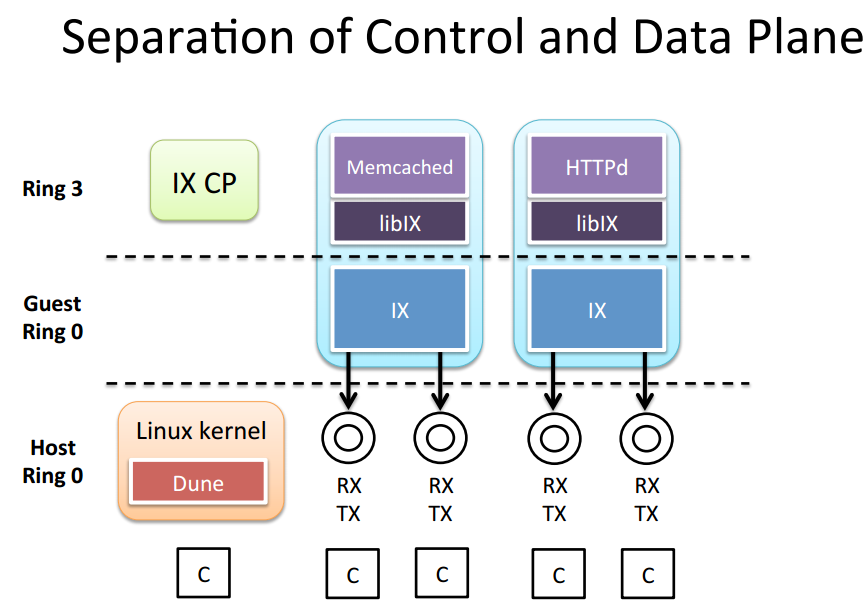
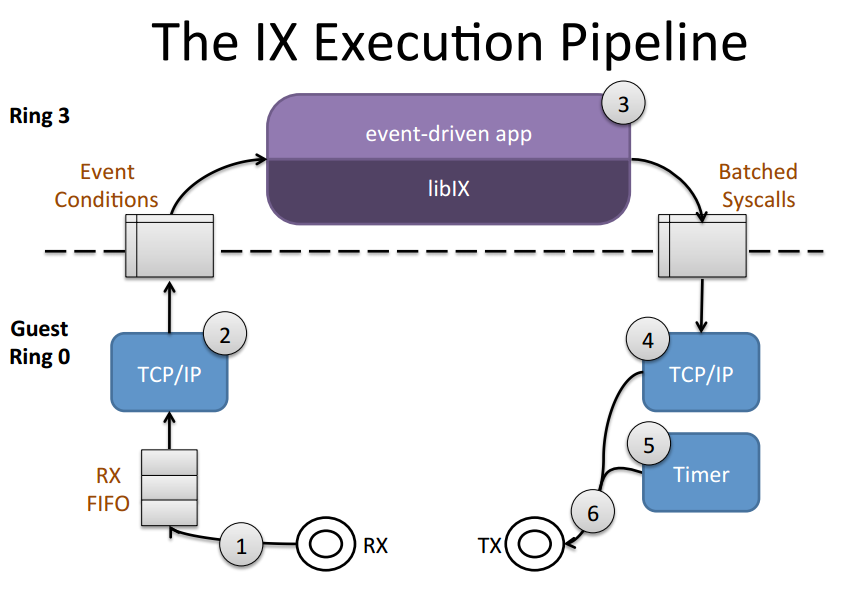

## Paper Review 
##### *IX： A Protected Dataplane Operating System for High Throughput and Low Latency*

## 背景
瓶颈：
1. 大量可用的硬件资源，与之相对的是过时的面向单核处理器的操作系统设计
2. 数据中心应用： 毫秒级拖尾响应、高包率，分布式系统下的应用隔离、资源效率
3. 现有方法主要思路
	1). Bypass	the	kernel	
    *  Move	TCP	to	user-space	(Onload,	mTCP,	Sandstorm)	
    * Move	TCP	to	hardware	(TOE)	
    
   2). Avoid the	connection	scalability	bottleneck	
	* Use	datagrams	instead	of	connec3ons	(DIY	conges3on	management)	
    * Use	proxies	at	the	expense	of	latency
 
   3). Replace	classic	Ethernet
    * Use	a	lossless	fabric	(Infiniband)	
    * Offload	memory	access	(rDMA)	

## 概述
主要提出一个分离控制层和数据层的操作系统架构(dataplane os),实现高I/O性能的同时保证系统的安全性。此处作者用到了12年实现的Dune架构，利用硬件虚拟化技术实现non-root状态下应用对底层硬件的直接访问。此处基于Dune 架构实现对网卡的直接读取。

## 系统设计
1. 数据层和控制层的分离和保护
	Kernel控制层：资源配置、部署、调度、监控
    Dataplane： 网络栈和应用逻辑；类似Dune的客户os，独立地址转换；直接对网卡队列的访问
    Untrusted User Code
2. 执行到底的可适应批处理(Run to completion with adaptive batching)
	* 一次到底的执行设计，使得不需要接收传输数据包，不需要在协议层间或协议栈和应用逻辑之间设置缓冲；只有当用户逻辑响应较长的少数情况下使用中断，使得cache locality很高
	* 适应性批处理 1) 只有拥塞出现时才使用批处理，non-blocking 2) 设置批处理包数目上限避免超出cache容量
3. 原生、零复制的API和显示流控制
	数据层和应用共同管理消息缓冲池；从NIC接收消息时便将消息存入内存，应用在读取时不需复制。
4. 流一致性哈希
	每个线程hash分配单独的网卡队列，不需要核间同步
    
## 实现
基于Dune的架构将Dataplane置于guest OS层，应用置于non-root ring 3层，使得Dataplane可以直接访问硬件特征如页表、错误机制、网卡，同时保证控制层、数据层和不可信应用代码独立运行的安全。系统架构如下所示。

IX提供了libIX的库方便应用直接对协议栈的访问，在此架构下用户可直接控制网络流。
两种线程：Elastic threads（非阻塞访问）和background threads

IX数据层提供了简单独立的内存管理机制，定义了数据包的数据结构以及包数组，使用了free-list， Mbufs等；由于EPT的地址空间长度映射不一致，使用large 页表size；提供网络超时机制

IX执行流程见下图

1. NIC的接收缓存已被映射到server的贮存中，NIC接收描述符环(RDR)已被配置使得数据包由DMA处理，Elastic线程轮询RDR查找新收到的数据包
2. Elastic线程处理TCP/IP栈内的数据并生成事件
3. Elastic线程切换到用户空间处理事件并对其做出响应，准备发送回复数据包
4. Elastic线程切回Ring0空间，处理批处理系统调用并调用TCP/IP机制
5. 使用定时器保证TCP的正常执行（丢包超时重传等）
6. 将发送的Ethernet frame 放入RDR并通知DMA处理发送；释放缓存等

## 结论
同时优化了带宽和延时，在延时、吞吐量、并发连接规模上outperform Linux和mTCP，并能充分利用网卡的带宽资源。

## Reference
[slides](https://www.usenix.org/sites/default/files/conference/protected-files/osdi14_slides_belay.pdf)