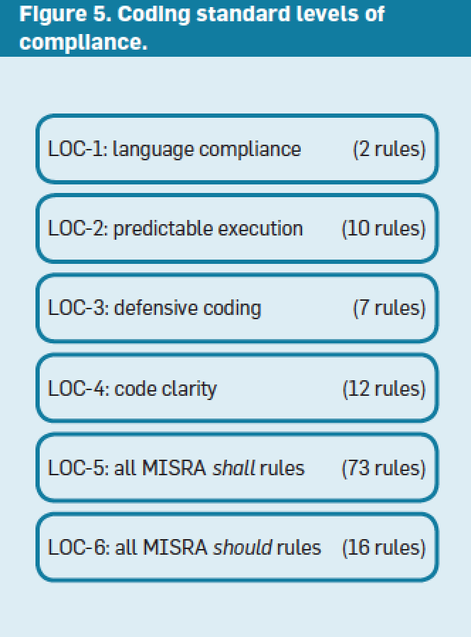

## Paper Review 
##### *Mars Code: Software Redundancy in Precaution*
本文讲述了MSL发射中的飞行器软件开发用到的一些预警方法，从以下几个方面表述
- 编程标准(coding standard)
- 重定义code-review过程
- 逻辑模型检查(logic model-check)工具提供对并发程序的检测

过往发射经验找到的编程和设计错误主要包括
- 不规范的使用多任务处理
- 使用动态内存分配
- 即使是使用了标准的错误保护技术也会无意产生一些副作用导致发射失败

Risk-related 编程标准：
- 编程规则需与之前发射找到的软件异常分类直接相关；
- 编程规则的承诺需能被基于工具的检查验证

1. 编程标准

不是所有的code都对应用同样重要，因此按规范分级：

- LOC1: 所有的代码符合语言规范，不依赖于语言定义外的编译器插件
- LOC2: 安全可预测的执行
- LOC3: 添加断言
- LOC4: 与发射有关的关键代码的限制
- lOC5~6: Safety-critical和human-related 软件，更严格

使用静态语言分析工具包括(Coveritym Codesnoar和Semmle自动检查以上规范的符合情况)

2. 基于工具的code-review:
- peer review
- static source code analysis

3. Model-check
开发了可以自动检测并发错误的工具。 拓展了model checker：Spin（分布式系统的异步线程执行）＋一个model extractor
文章展示了该工具的使用范例。具体见原文。