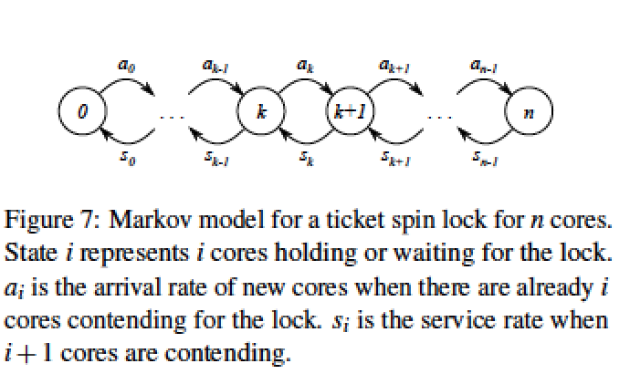
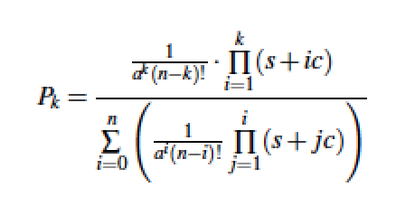
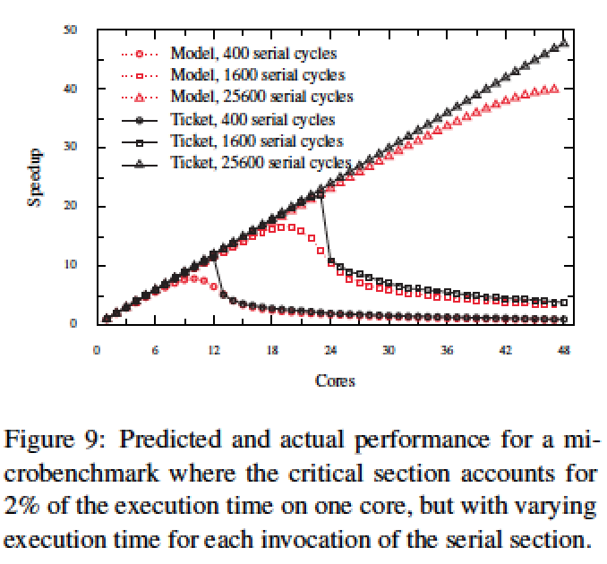
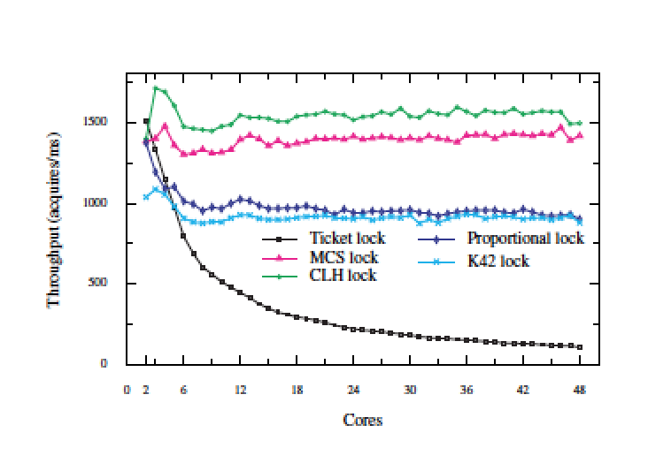

## Paper Review
##### *Non-scalable locks are dangerous*

## 综述

本文介绍了多核环境下非可扩展锁造成系统整体性能的坍塌式下降的现象，并提出一个马尔可夫模型来模拟系统系能随核数变化曲线。模型较好的吻合实验结果，说明性能塌缩是非扩展锁带来的本质影响而不是其他因素。文末，使用MCS锁取代Linux自旋锁作性能测试，消除了多核下塌缩现象。

## 背景
论点：
- 非自旋锁严重降低了整体性能，这现象在实际应用中也可能出现
- 性能坍塌可能随核数增加突然出现
- 短的critical section可能导致严重的性能坍塌

贡献：
- 说明non-scalable lock造成严重的性能损害
- 提出一个全面的模型模拟非扩展自旋锁的行为
- 验证MCS最大程度提升了X86 CPU的可扩展性

以Linux kernel ticket lock为例：
- 获得锁: next_ticket自增直到current_ticket
- 释放锁：current_ticket自增

读操作为串行cache line，因此每个lock的传送时间正比于等待的核数O(N)

对自旋锁用了四种Benchmark: FOPS（频繁创建关闭共享文件process/per core ）, MEMPOP（分配内存）, PFIND（文件系统find操作）,EXIM（mail server，并发SMTP连接），分别显示了不同起始位置开始的性能坍塌。

由实验结果提出的疑问：
- 坍塌转折点比预期早
- 坍塌太快、太多

## 建模
对锁等待队列可能的核数（作为状态）建模(0~N)，得到马尔科夫链。a_k表示从等待核数k增长到k+1的“到达率”，s_i表示i+1个等待核减少为i个核的“服务率”。

合理建模
$$$a_k = (n-k)/a $$$, a为单核连续获取锁的平均等待时间，

$$$s_k = \frac{1}{s+ck/2}$$$, s为critical section串行操作时间，c为家目录对cache line的响应时间；ck/2表示k个核竞争下winner取得锁的平均时间。

$$$ w = \sum_{i=0}^n i \cdot P_i $$$可得锁的期望等待核数
## 实验分析
验证模型结果：基本吻合

发现实验结果比模型预期有更尖锐的坍塌，是因为ticket lock在坍塌点性能不稳定所致
坍塌原因：$$$s_k$$$随k增大迅速减小，“消费率”越来越低，等待锁时间变长

结论：
- ticket的剧烈性能坍塌是设计的固有属性
- 性能坍塌只出现在短串行区下
- ticket lock的坍塌使得应用达不到Amdahl定律所标定的扩展程度

## 锁性能比较
可扩展锁与非可扩展锁

实验了MCS锁取代Linux自旋锁，发现基本消除了性能坍塌现象。

