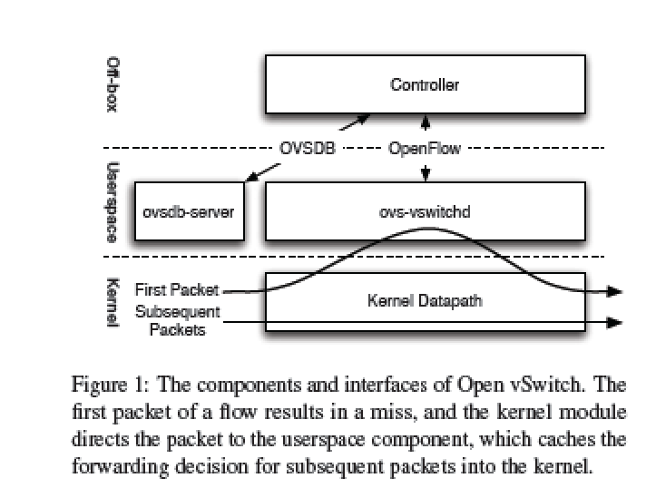
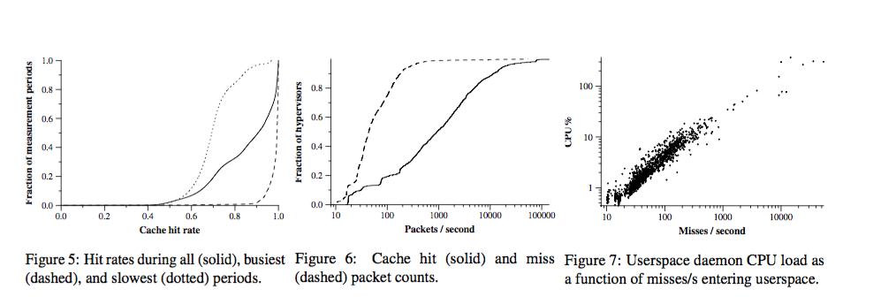

## Paper Review 
##### *The design and implementation of open vswitch(VMware) NSDI'15 best paper, cited by 45*
## 综述
本文主要介绍Open vSwitch的设计和实现，详细论述了Open vSwitch是如何实现软件层面对数据包转发的控制：如何实现Control Plane和Dataplane之间的通信，如何设计流表缓存，如何保持缓存一致性，如何最大化查找效率等等。

基于OpenFlow的OpenvSwitch应用越来越广泛，终将成为虚拟机、容器这些虚拟平台的通用网络解决方案。它的优点在于独立于物理网络架构，基于隧道可部署在任意数据中心网络架构上。然而Openvswitch带来较多的软件层面的Overhead，比如它CPU使用率远远高于Linux bridge.

目前的Openswitch是stateless的，未来的趋势需要提供stateful的功能，比如加入stateful的ACL防火墙功能等（目前通过一个hypervisor上的 local controller daemon可保存一部分state信息）;加入stateful信息之后，openflow表也可以通过当前连接信息(connected, new, established)作为关键字来构造规则。

另外，userspace的networking也是一个优化方向，通常通过共享NIC, virtual switch和VM的内存实现数据包到VM的最小overhead. 如何减少kernel的overhead也是一个提升openvswitch性能的优化方向。

这篇文章的意义在于表明了基于SDN架构的虚拟交换机的实现方法，openvswitch作为一个开源软件将获得越来越多主流云平台、虚拟机网络解决方案的支持，而它所提出的性能瓶颈和优化方向也将开拓出一个新的研究方向。

## 背景
以往的virtual switch只focus在提供基本的网络功能，模仿ToR将L2网络移植到Hypervisor里，具有不可移植性，受L2本身的瓶颈。新的设计利用virtual switch 为VM提供网络功能，在物理网络上使用IP Tunnel传输，便独立于物理网络的部署。

## 设计原则
保证Generality的前提下performance最大化

- Resource sharing: 保证主任务的资源avaliability而不是worst case
- Placement：放置在网络边缘节点简化网络，然而不scalable
- SDN：Open vSwitch作为OpenFlow switch，支持OpenFlow越来越广泛的使用用途（Flexibility导致处理流程变长，更重的分类负担，需要flow caching来保证公平性）; 开源多平台导致了模块化和移植性的需求

## 系统架构

Workflow： kernel Datapath执行cache 操作，controller将flow table发送给 ovs-vswitched ，Kernel Datapath从NIC提取数据包，不知道如何转发则传给ovs-vswitched，ovs-vswitched根据流表规则发送action给KD执行

## 功能实现

##### 核心功能：Packet Classification— tuple search classifier

- tuple：hash表的lookup key
- 实现方法：每增加一个有不同match形式的流规则，新增一个hash table。一个packet的分类必须经过所有表的匹配——若只在一个表出现则按该表action走，多个出现则按优先级
- 优点：常数时间内将流更新操作转化为hash表操作；tuple search算法具有一般性，内存占用正比于流数；
- 缺点：长pipeline（对应长查找时间）

##### OpenFlow编程模型
- 最初： MicroFlow： 匹配所有OpenFlow支持的域： 275bit/microflow， 表里需要2^275个entry， 不适用于轻量级。引入的”cross product”问题：独立的A，B联合查询变成n1*n2；解决方案： Action “resubmit” ：多个表依次匹配不同域。OpenFlow 1.1： multi-table特性。后向兼容resubmit
- “Register”: controller没有temporary storage的access，因此引入metadata域register，action可以复制修改它。典型引用用它记录数据包的逻辑传输地址(VMware NVP)
- openflow是基于流的，控制快速变化的比如流表；长期的配置存储用ovsdb-server（实现OVSDB协议）

##### Flow cache Design:
- Mircoflow Caching: 每个entry都与OpenFlow 支持的所有包头对比（极细粒度）。每一个新的update都造成miss，需要重新在userspace查询流表(flow setup时间长)；Batching和multithreading只能优化一部分
- Megaflow Caching: 类似OpenFlow表只比较特定field，但比OpenFlow table简单轻量级在于：无优先级，只用一个megaflow classifier（无pipeline）。缺陷，依然需要lookup多个hash表；
- 折中：Microflow作第一层hash包到特定megaflow hash表

##### 查找(Caching-aware Packet Classification)
- Tuple Priority Sorting:  按优先级降序匹配，一旦找到match的就返回
- Staged Lookup: 优化前必须匹配tuple的所有field，即使匹配失败，所以需要合理剪枝。Solution：将Fields划分到4个组：metadata, L2, L3, L4，每个stage会包括之前的stage的fields
- Prefix Tracking: 使用Trie树进行前缀匹配。例子：IP掩码匹配(LPM查找）

##### 删除(Cache Invalidation)：
Megaflow：
- 问题：在Megaflow缓存中，若Controller修改了流表，则会与cache不一致，比如流表加了一条比cache优先级更高的转发规则。
- Solution： 按Flow影响广度分为两个group，第一个group的更新会force所有data path flow， 问题是OpenvSwitch是单线程，遍历流表会导致其他操作block。OpenFlow 2.1已经加入multithread for revalidation和multithread setting up flows；另一个利用tags，标定某一项流（如MAC学习表）的tag，若更新则tag加入更新池，batch处理。在OpenFlow 2.0， tags被BoomFilter取代。
- 另外，Megaflow使用flow statistics删除不常用的流规则

Mircoflow:
- 使用伪随机替换策略删除outdated流规则

## 性能
在1000台主机的多租户网络以10min一次的采样率采集24小时的流量信息，从以下几个方面衡量OpenvSwitch的性能：
Cache大小：99%的主机Cache上有最多7033条流信息

与Linux bridge(In-kernel)比较：两者的throughput差不多(18.8Gbps),openvswitch使用更多的CPU(161% vs 48%),但openvswitch的overhead是per-megaflow,linux bridge是per-packet（随数据包数增长）

## Future work
1. Stateful Packet Processing
2. Userspace Networking(NIC，virtual switch, VM共享内存)
3. Hardware offloading