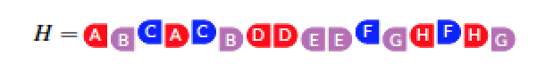
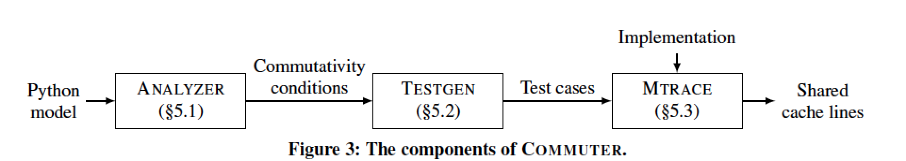
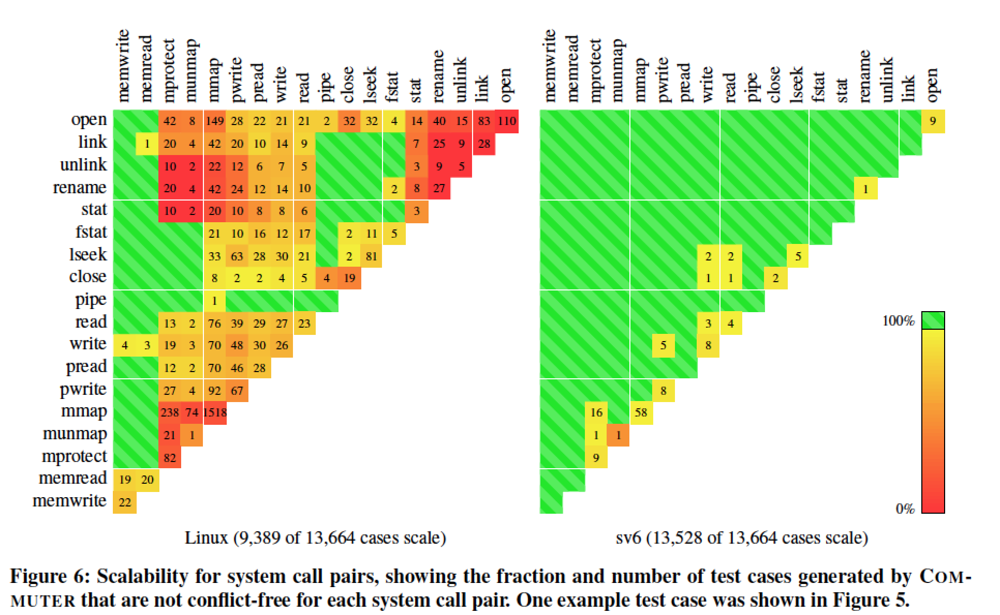

## Paper Review 
##### *The Scalable Commutativity Rule: Designing Scalable Software for Multicore Processors*
综述
Interface的可扩展性在定义的时候就可以被确定而不需要等到具体实现时才发现，scalable community rule(可扩展互换规则): 理论上当interface操作可交换时，他们可以有可扩展的实现。本文证明了这个定理，并给出了叫COMMUTER的工具，可以自动发现接口模型的可交换性，并自动生成C的测试程序辅助程序开发。有了这项证明后，程序的开发流程有了质的改变：先判断接口API的可交换性（Commutativity）从而判断是否可扩展，再寻找可以扩展的实现。

Commutativity: 直观而言，当操作可交换，则它们的结果将与执行顺序无关。给定并发、可交换的操作，则他们一定有可扩展的实现。

1. Rule proof：
首先定义Action： 一个Action包括：一个操作类（调用的system call）、参数或返回值、一个相关线程、和一个唯一性标识。由此定义历史

颜色表线程，字母表示Action，左表示invoke，右表示response。同一线程的的串行操作不可交换，不同线程的操作可交换。
SI-commute in H = X ||Y : 当给定任意Y的重排序Y'，和任意Action序列Z

SIM-commute in H = X||Y: 对任意Y的重排序列的前缀P，P SI-commute in X||P.
SIM-commutativity可直接推断出可扩展性，且只取决于接口定义而不是实现。

 规则：
 Assume a specification S with a correct reference implementation M. Consider a history H =X ||Y where Y SIM-commutes in H, and where M can generate H. Then there exists a correct implementation m of S whose steps in the Y region of H are conflict-free.

 规则的证明一步步从给定条件构造出一个conflict-free的实现，此处不赘述。值得说明的是，可交换性是接口有可扩展实现的充分不必要条件。

2. POSIX 分析
本文接着分析了POSIX中system call影响commutativity的API实现，比如fork。 因此为了提高commutativity的原则是：非决定性定义、允许弱排序、异步释放资源。

3. COMMITER工具

该工具主要包括三个组件
- Analyzer:以python符号描述的接口模型为输入，可用符号执行遍历接口模型所有操作的排列，生成完整的可交换条件。
- Testgen：转换Analyzer输出的可交换条件为具体的test case，使得实现中潜在的扩展问题暴露出来。
- Mtrace：在真正的接口实现中运行Testgen生成的测试案例，判断实现是否conflict free。Mtrace利用qemu的hypercall记录内存访问，然后在不同的虚拟内核中运行test case。从log中获取冲突的内存访问。

4. Evaluation
文章对比了linux下和定制sv6操作系统下运行test case的情况。Linux的可扩展操作的比例为9389/13664，sv6为（13528/13664），充分说明了如今成熟的操作系统仍有很多不可扩展的设计阻碍了规模化。于是本文的工作对操作系统的并发设计有指导意义。

## 课程讲解
背景： 多核情况下系统性能不再提升，源于对共享内存的访问
Kernel Scalability is important: 由于内核的通用性， 代码本身复杂，通常kernel比应用需要更多的县城
interface scalability:
以同时创建三个文件为例： create("X"),create("Y"),create("Z")
不能并行：分配FD时默认申请最小的文件描述符,可通过per-core solution解决
Design: Guides degsign of scalable interfaces
Implement: Set a clear implementation target
Test: Systematic, workload-independent scalability testing
对比gmake和exim的scale bottleneck

H: 一系列action运行的结果符合对interface的定义

