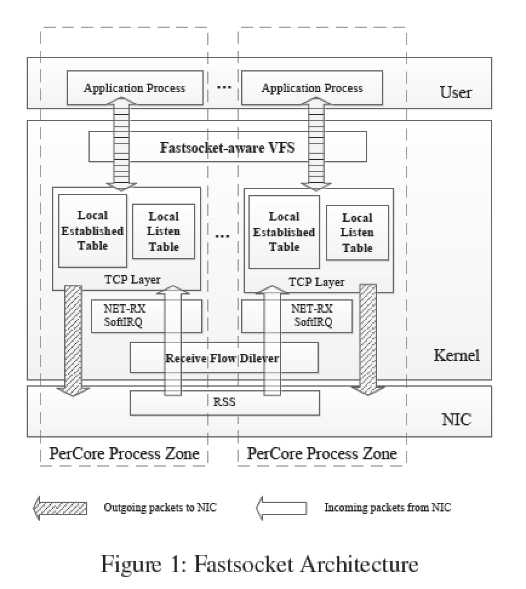
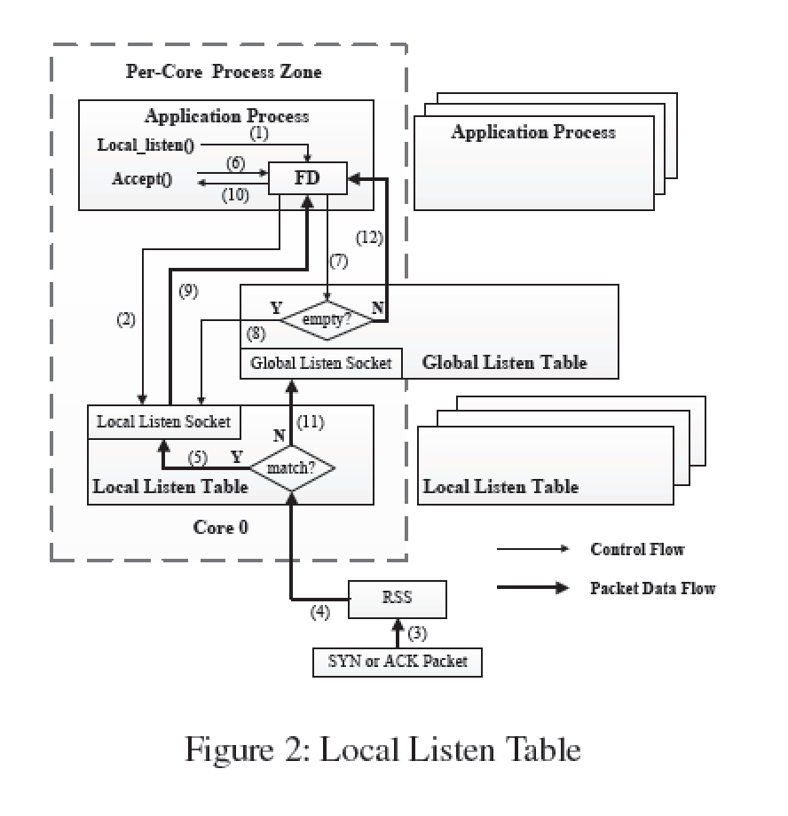

## Paper Review
##### *Scalable Kernel TCP Design and Implementation for Short-Lived Connections*

## 综述
Fastsocket:一个兼容BSD 套接字API的可扩展内核socket设计，对比Linux内核baseline，实现了24核主机上short-lived连接20.4倍性能提升，Nginx 247%和HAProxy 621%。

## 背景
挑战：
1. TCB管理：listen table和established table 全局共享->同步锁
2. VFS抽象：把socket当做文件处理，造成无必要的文件系统overhead
3. 生产环境需求：兼容TCP/IP相关RFC、安全性、资源隔离和共享

突破点：
- 划分全局共享数据结构：listen table和established table 
- 正确引导接受到的包实现连接locality
- 提供VFS对套接字的快速访问路径，同时保持对BSD套接字的兼容性

## 相关工作
1) 对Global Listen Table：
- Linux SO_REUSEPORT: 每个app process保留一份listen socket副本，同个端口多核监听，遍历bucket list分配连接------造成额外overhead；遍历O(N)

- Naive table level 划分：每个CPU核建立自己的listen table,破坏TCP鲁棒性：如果app进程crash则local listen table也被销毁，连接单方面断开。

2) 缺乏Connection locality
Complete Connection Locality: 同个连接的各个活动总在同个核上处理。
active connection: 主动连接对方服务
passive connection: 自己监听，对方连接

- Passive connection: Affinity-Accept和Megapipe的工作，把新连接分配到应用运行的核上，不适用于使用active connection的RPC和proxy应用
- RFS(Receive Flow Deliver)记录socket与核的映射
- NIC FDir(Flow Director)：ATR（网卡级别随机采样记录connection-CPU-mapping），Perfect-Filtering:用户可编程基于包IP和TCP信息分配到CPU（事实上NIC层缺乏这信息）

3)兼容性overhead
- VFS使得socket读写也需involve到inode等文件系统锁操作，带来较大overhead
- mTCP 高级特性难以实现，同时bypass kernel的直接IO操作也需与Kernel共享NIC的锁
- Megapipe不兼容BSD socket

## 设计

- 每个核单独的Local listen table和established table
- incoming socket-> RFD -> proper CPU core's local table
- Fastsocket-aware VFS

##### Full partition of TCB Management
Local listen table

Fast Path: 
(3)SYN Packet-> (4)RSS分配到Core 0-> (5)插入local listen table-> 3 way handshake -> (6)accept queue -> (7)kernel检查global listen socket -> (8)kernel检查core 0 listen table的ready connection-> (9)(10)返回
Slow Path:
错误：当copied process crash，local listen table丢失
(11)不match , 在global listen socket建立新连接，于是在(7)检查global listen socket的时候可以得到新的连接socket
##### Complete Connection Locality
RFD 映射 $$$ c_{核ID}= hash(p_{src})$$$。检查包TCP头作socket-core-mapping 
- 如果source port为常用端口，则是active incoming包（主动连接）
- 如果dst port为常用端口，则为passive incoming包（主动监听）
- 否则，检查listen socket，match则为passive，反则为active

利用NIC的FDir特性ATR或Perfect-Filtering作Mapping

本文hash
$$
hash(p) = p & (ROUND_UP_POWER_OF_2(n) - 1)
$$
适用于Perfect-filtering
##### Fastsocket-aware VFS
避免无必要的Overhead，保持兼容性（lsof等接口的访问）

##性能评估
平台: 2* 12-core Intel Xeon E5 2697， 64GB RAM, dual-port 10GE NIC.
