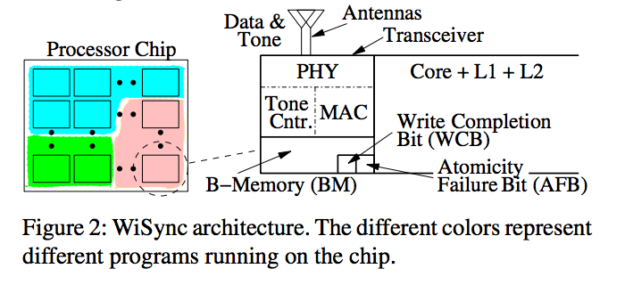
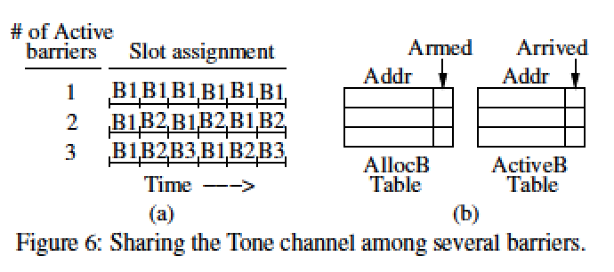
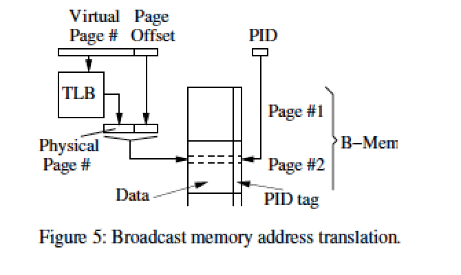
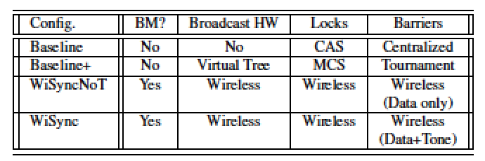
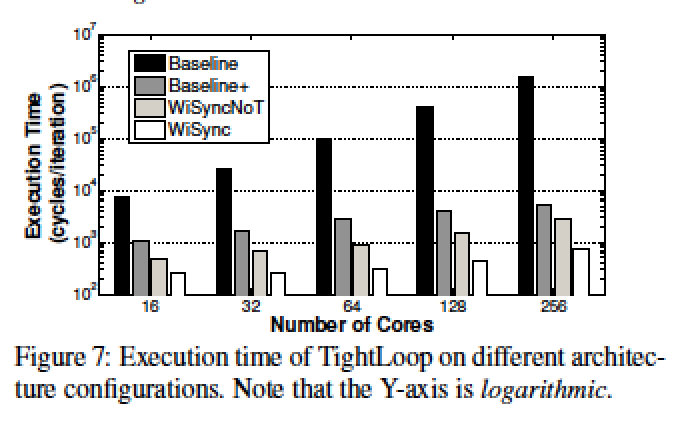
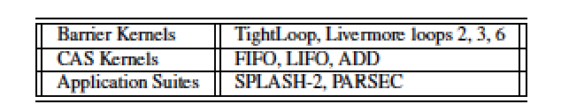

## Paper Review
##### *WiSync: An Architecture for Fast Synchronization through On-Chip Wireless Communication*

## 综述
文章提出一个利用无线通信在多核架构下实现快速同步的方法，达到了比当前片上网络快一个量级的点对点通讯速度。

主要组成部分
- per-core Broadcast Memory(BM)
- Data Channel & Tone Channel
- Write Completion Bit(WCB)& Atomicity Failure Bit(AFB)

## 硬件支持

Concern: 面积/功耗与频带宽度的tradeoff
常见的片上无线通信网络一般使用中心频率在60GHZ左右的16-20GHZ频带，频带越大，需求的片上面积和功耗都越大；同时，中心频率越高，所需面积越小，因此90HZ的中心频率支持更容易支持更大带宽，也经常被使用。

Yu等人的工作使用65nm的CMOS技术建立了天线和收发器实现16Gb/s带宽，占地0.23mm^2功率31.2mW。这是个保守的实现，相对的，使用22nm的CMOS技术可以实现在片上0.1mm^2和16mW的功率而不减少带宽。

因此， 在片上实现收发天线，利用无线通信实现通信有成熟的技术支持。

## WiSync 架构

#### 如何工作
- 每个核有L1、L2级缓存，两个天线和一个收发器、BM和2个特殊标记位
- 简单起见，只考虑所有核共享信道收发数据，因此采用冲突检测
- BM用于程序中的广播变量，利用无线信道在所有核中完全同步
- 一个收发器包括：物理层(PHY，调制解调和（反）序列化)，数据链路控制层(MAC，冲突检测)，Tone Controller
- 批处理Bulk load/store:一次连续读/存4个连续地址,BM_Address和R

##### 无线传输
###### Data Channel
- 使用单信道传输（进程内同步），信道时分为1ns一个slot，对应1GHZ的核时钟
- 传输数据77bits（数据64+地址11+Bulk位+Tone位），使用4个cycle传输（77b/4ns=19Gb/s）
- 为冲突检测，使用5个cycle传输，第2个为监听冲突期
- Bulk位指示是否批传送，批处理则需要15个时钟周期（后三条消息不需要地址、冲突检测和Bulk位）
- 冲突检测用指数退避算法
- Tone位置位出现在：当第一个core到达barrier时，通过Data Channel发送置位Tone的消息通知其他核，其他核开始在Tone Channel发送Tone消息，等到了barrier后停止

###### Tone Channel
- Tone Channel带来的overhead只是2mW
- Tone信道用于多核同步
- Sense-Reversing barrier: 第一个核先到达barrier，DataChannel发送同步消息，执行指令tone_st,同时检测同步完成tone_ld（轮询）；其他核开始在Tone Channel不停发送Tone消息造成冲突，直到当前核到达
- 多并发tone barrier同步（时分复用time slot, round-robin)
	- 程序创建Tone Barrier－在AllocB表中分配Entry（BM地址＋Armed标记－当前核是否参与这个barrier）；程序到达某Tone Barrier－ActiveB从AllocB里拷贝Entry（BM地址＋Arrived标记）；两个表除了标记位完全同步，所以每个核都能检测slot的分配

两种信道都支持上下文切换，然而只有Data Channel支持线程迁移、多线程共享核，因为Tone Channel是hardware-managed

##### 原子读写指令（RMW）
Test&Set, Fetch&Inc, Fetch&Add, Compare-and-Swap(CAS);原子指令执行包括读本地地址、拷贝数据到流水线、在流水线中更新数据，写回BM并核间同步。这四个步骤里每一步都可能被打断，因此需要以下机制来保证：
 - store & RMW 都有写回操作，当核执行写操作时，收发器广播更新其他BM，若有冲突发生则不断重试，如果成功则更新本地BM，置位WCB，流水线得到写成功通知；
 - 若在RMW读操作完成之后数据被其他节点的广播更新，则硬件比较incoming stores的地址与pending RMW的地址，此时RMW会置位AFB，写回将失败，但仍置位WCB

##### BM内存管理：
 - 广播变量直接由核在BM中存取，不经过缓存；核利用TLB虚拟地址间接访问BM
 - 类似TLB，每个BM分配一个Entry给广播变量，64位数据+标记PID；BM尽量小，如4*4KB页表（对应传输数据的11位地址）

## 性能评测
对比了四种情况下的多核性能

执行时间对比

发现WiSync比Basline有大大的提高，尤其是核数越大，提升效果越明显；另外，单独设置Tone Channel减少了冲突次数，也提高了执行效率（对比WiSyncNoT和WiSync，至少一个数量级的提升）
运行集中不同的Kernel和Application，都得到了WiSync的优异表现（1.12倍）。

