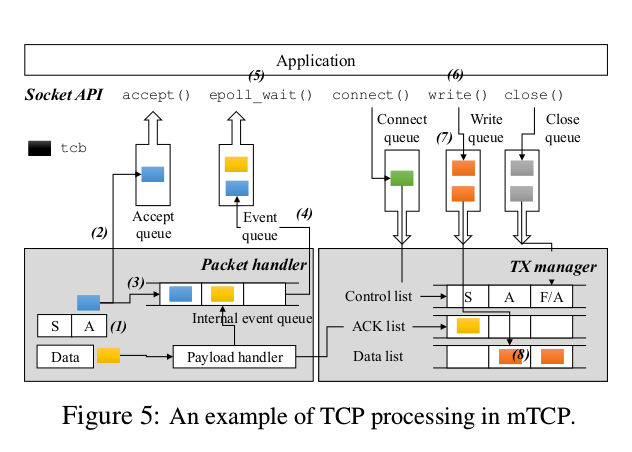

## Paper Review 
##### *mTCP: A Highly Scalable User-level TCP Stack for Multicore Systems*

## 综述
mTCP: 一个多核系统下的高性能用户态TCP栈。主要工作：
- 采用现有的有名的技术
- 转换多个昂贵的系统调用为单共享内存引用
- 允许有效的流层事件汇总
- 对数据包IO进行高效批处理

贡献：
- 说明整合数据包和套接字层的批处理可以大幅度有效提升性能
- mTCP规避了对kernel的修改，在用户态提供了BSD类似的套接字和epoll类似事件驱动的接口

实现了25倍Linux和３倍Ｍega Pipe的性能提升

## 背景
短消息占TCP连接的大比重，然而支持大规模并发的短TCP连接仍是瓶颈。以往工作大部分focus在OS或实现的overhead、多核竞争上，要么需要对操作系统大量修改、要么关注实现方式沦为表层，这篇文试图在用户态直接访问网卡，从而得到高效的实现，避免用户态核心态的切换及系统调用的overhead.

Kernel TCP栈的缺陷：
- 缺乏连接locality：多线程在socket accept queue竞争，目前的有优化方法有：为每个CPU核提供单独的accept队列，Linux的SO_REUSEPORT 选项
- 共享文件描述符空间：讲”分配可得的最小文件标识符“改为”可得的任意标识符“，去掉lock
- 低效的单个数据包处理：每次调用malloc（）多核竞争，解决方案：批处理
- 系统调用overhead: system call batching, efficient syscall scheduling

## 设计

#####　数据包IO
- 多Tx Rx队列，RSS绑定socket到queue
- 扩展PSIO(PacketShader I/O engine) 实现基于时间的数据包IO接口
- 非阻塞的select,允许中断
- 批处理接受到的数据包，因为PCIe操作如DMA地址映射、IOMMU查找都很昂贵

##### 用户态TCP栈的设计
- 若mTCP实现在应用程序主线程，TCP的调用顺序会影响程序正确性
- mTCP单独开线程，通过共享内存与应用程序通信

###### 基本mTCP处理流程

######无锁的核独立的数据结构
- 线程映射和流层核联接(RSS负载均衡;mTCP线程与应用线程分配到同一个核)
- 多核、缓存友好的数据结构(大部分数据结构local,　共享变量通过单生产消费队列实现无锁；常访问得到数据结构对齐cache line; per core tcb内存池、大页表size减少TLB miss)
- 高效TCP timer管理：sorted list或hash table（以剩余时间为index）

###### 批处理事件
###### 对短生存时间连接的优化
- 优先数据包队列：control list/ACK list先于data list处理
- 轻量级连接建立：预分配内存给mTCP，在用户态分配内存，减少内核态切换

###### socket API
- 实现了accept/pipe/socket/epoll；放宽file descriptor约束
- 修改app: lighttpd, ab, SSLShader

###### Tradeoff
- App与TCP栈共享内存，难以debug,易出错
- socket fd的分配逻辑修改，可能影响到基于此特性的app
- 需要实现Kernel TCP栈的全部逻辑，工作量大
- 目前只支持一个应用访问NIC，寄希望于硬件层次的隔离技术，如VMDq, SR-IOV等使得多用户态应用共享NIC端口成为可能。

## 实验
服务器：8核CPU, 32GB RAM, 10GbE NIC 
５个客户端
在短消息实验中，mTCP性能分别达到25x, 5x, 3x相比Linux, REUSEPORT, MegaPipe